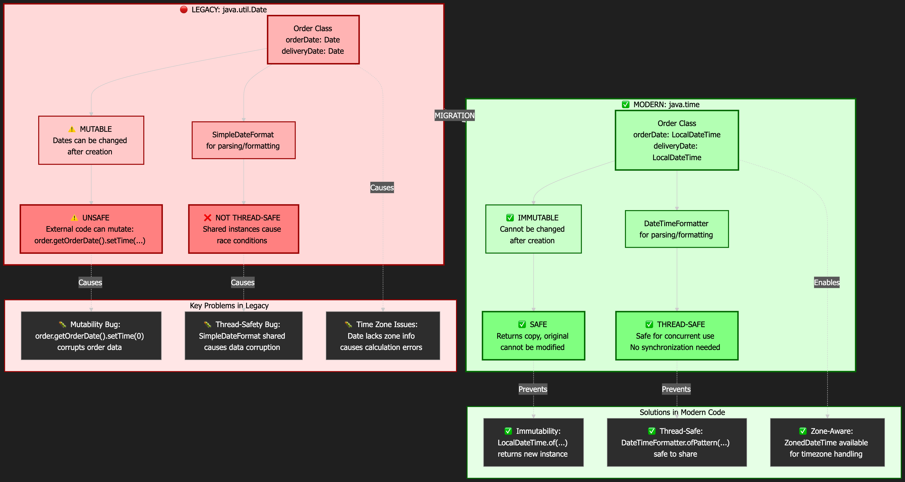

# Lab 1: Analyze Legacy Java Code with Bob

**Duration:** 10 minutes  
**Difficulty:** Beginner  
**Focus:** Understanding legacy Date/Calendar problems in enterprise code

## 🎯 Objectives

By the end of this lab, you will:
- Use Bob to analyze legacy Java 8 code
- Identify Date/Calendar API problems
- Generate a modernization analysis report & diagram

## 🏢 Enterprise Context

Legacy Date/Calendar APIs cause critical issues in enterprise applications:
- **Mutable objects** → Timestamp corruption
- **Timezone confusion** → Cross-region operation errors
- **Thread-safety issues** → Concurrent processing bugs
- **Unclear semantics** → Developer mistakes

### 🔒 Security Concerns with Legacy Java

Old Java versions (like Java 8) have known security vulnerabilities that are no longer patched. For example:

**Simple Security Risk:**
```java
// Java 8 - Vulnerable to deserialization attacks
Date orderDate = (Date) inputStream.readObject(); // ⚠️ Security risk!
```

‼️When your application accepts serialized Date objects from external sources (APIs, files, network), attackers can inject malicious code. Java 21's modern APIs are designed with security in mind and have built-in protections.

**Why This Matters:**
- Java 8 reached end-of-life for public updates in 2019
- Security patches are only available through paid support
- Modern Java 21 includes 5+ years of security improvements
- Financial institutions require up-to-date security compliance


## 🔨 Exercise: Analyze Legacy Enterprise Code

### Step 1: Review the Legacy Order Class (2 min)

Navigate to the legacy code:
```bash
cd legacy-codebase/src/main/java/com/example/ecommerce/model/
```

Open `Order.java` and examine:

```java
public class Order {
    private Date orderDate;          // Record timestamp
    private Date deliveryDate;       // Due date
    
    public boolean isOverdue() {
        if (deliveryDate == null) {
            return false;
        }
        Date now = new Date();
        return deliveryDate.before(now) && status != OrderStatus.DELIVERED;
    }
    
}
```

**Problems to Identify:**
1. Date is mutable - can be changed after creation
2. Calendar API is verbose and confusing
3. No explicit timezone handling
4. Thread-safety issues with SimpleDateFormat (in other files)

### Step 2: Analyze with Bob (5 min)

1. **Launch Bob IDE** and switch to **Plan Mode** (📝)

2. **Add Order.java to context:**
   - Type `@legacy-codebase/src/main/java/com/example/ecommerce/model/Order.java` in Bob's chat
   - Select `Order.java` file

3. **Ask Bob to analyze:**

```
Analyze this Order class for Java modernization opportunities.
Focus on:
- Date/Calendar usage and problems
- Enterprise-specific concerns (data integrity, cross-region operations, timezones)
- Thread-safety issues
- Code maintainability

Create a concise analysis report.
```
### Step 3: Create a Visual Diagram (2 min)

**Switch to Ask Mode** (❓) and ask Bob to draw a diagram:

```
Draw an image of a flowchart comparing 'java.util.Date' (legacy, red) to 'java.time' (modern, green) in 'Order' class. Focus: 
- orderDate / deliveryDate (unsafe mutability vs immutable)
- SimpleDateFormat (unsafe thread-safe)
```

**Example output you might get:**


### Step 4: Review Key Findings (2 min)

Bob's analysis should highlight:

**Critical Issues:**
- ✗ Mutable Date objects → data corruption risk
- ✗ No timezone handling → cross-region errors
- ✗ Thread-safety gaps → concurrent bugs

**Modernization Path:**
- ✓ Date → LocalDateTime/ZonedDateTime
- ✓ Calendar → java.time APIs
- ✓ SimpleDateFormat → DateTimeFormatter


## ✅ Success Criteria

You've completed Lab 1 when:
- [ ] You've analyzed Order.java with Bob
- [ ] You understand the Date/Calendar problems
- [ ] You can explain enterprise-specific risks

## 🎯 Next Steps

**Ready for Lab 2?** In [Lab 2](../lab2-migrate-datetime/instructions.md), you'll use Bob to migrate this code from Date/Calendar to java.time API!
