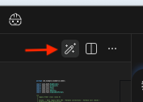

# Lab 2: Migrate Date/Calendar to java.time API

**Duration:** 30 minutes  
**Difficulty:** Intermediate  
**Focus:** Hands-on migration using Bob's automated transformation

## 🎯 Objectives

By the end of this lab, you will:

- Migrate Date → LocalDateTime for transaction timestamps
- Convert Calendar → ZonedDateTime for timezone-aware operations
- Update SimpleDateFormat → DateTimeFormatter
- See immediate code quality improvements

## 📋 Setup

Ensure you have:

- [ ] Completed Lab 1 (analysis)
- [ ] Bob IDE in **Code Mode** (💻)

## 🔨 Exercises

### Exercise 1: Migrate Date to LocalDateTime (10 min)

**Example Use Case:** Transaction timestamps that don't need timezone information (all in same timezone).

#### Step 1: Open the Legacy Code

Navigate to:

```bash
cd legacy-codebase/src/main/java/com/example/ecommerce/model/
```

Open `Order.java` in your editor.

#### Step 2: Migrate with Bob

1. **Switch to Code Mode** (💻) in Bob IDE

2. **Add Order.java to context:**
   - Type `@legacy-codebase/src/main/java/com/example/ecommerce/model/Order.java`
   - OR drag the file + press Shift to drop file to chat

3. **Ask Bob to migrate:**

```
Convert the Order class Date fields to LocalDateTime.
Focus on:
- orderDate should be LocalDateTime (transaction timestamp)
- deliveryDate should be LocalDateTime (settlement date)
- Update the isOverdue() method to use LocalDateTime comparison
- Keep the code clean and maintainable
- Preserve all business logic
```

#### Step 3: Review Bob's Changes

**Before (Java 8):**

```java
public class Order {
    private Date orderDate;
    private Date deliveryDate;

    public boolean isOverdue() {
        Calendar cal = Calendar.getInstance();
        cal.setTime(deliveryDate);
        return cal.before(Calendar.getInstance());
    }
}
```

**After (Java 21) Sample:**

```java
public boolean isOverdue() {
    return deliveryDate != null
        && deliveryDate.toInstant().isBefore(java.time.Instant.now())
        && status != OrderStatus.DELIVERED;
}
```

**Key Improvements:**

- ✅ Immutable - Safe for concurrent transactions
- ✅ Clearer API - `isBefore()` vs Calendar comparison
- ✅ Better performance - No Calendar overhead
- ✅ 5 lines → 1 line in isOverdue()

---

### Exercise 2: Handle Timezone-Aware Operations (10 min)

**Example Use Case:** International wire transfers requiring timezone awareness.

#### Step 1: Add Timezone Support

**Ask Bob:**

```
Update the Order class to use ZonedDateTime for timezone-aware operations.
This is for international banking transactions that need to track:
- Transaction time in customer's timezone
- Settlement time in bank's timezone (America/Toronto)
- Proper timezone conversion for reporting
```
#### Step 2: Add Method Using Literate Coding Mode

**Switch to Literate Coding Mode:**
   - Click the pen icon on top right corner🖋️
   - Type in-line prompt `Add a method to convert order date to bank timezone.` and click 'Generate'.



**Example Result:**

```java
public class Order {
    private ZonedDateTime orderDate;        // Customer timezone
    private ZonedDateTime settlementDate;   // Bank timezone

    public boolean isOverdue() {
        ZonedDateTime now = ZonedDateTime.now(ZoneId.of("America/Toronto"));
        return settlementDate.isBefore(now);
    }

    public ZonedDateTime getOrderDateInBankTimezone() {
        return orderDate.withZoneSameInstant(ZoneId.of("America/Toronto"));
    }
}
```

**Benefits:**

- ✅ Explicit timezone handling
- ✅ Accurate cross-timezone calculations
- ✅ Regulatory compliance (proper audit trails)
- ✅ No timezone conversion bugs

---

### Exercise 3: Modernize Date Formatting (5 min)

**Example Use Case:** Generating reports with properly formatted dates.

#### Step 1: Update Formatting Code

**Ask Bob:**

```
Replace any SimpleDateFormat usage with DateTimeFormatter for thread-safe date formatting.
Include formats for:
- Transaction reports (yyyy-MM-dd HH:mm:ss)
- ISO format for regulatory submissions
- Make formatters static final for reusability
```

#### Step 2: Review Thread-Safe Formatting

**Before (Java 8 - NOT thread-safe):**

```java
public String toString() {
    SimpleDateFormat sdf = new SimpleDateFormat("yyyy-MM-dd HH:mm:ss");
    String formatted = sdf.format(orderDate); // Requires synchronization!
    return formatted;
}
```

**After (Java 21 - Thread-safe) Sample:**

```java
private static final DateTimeFormatter TRANSACTION_FORMAT =
    DateTimeFormatter.ofPattern("yyyy-MM-dd HH:mm:ss");

private static final DateTimeFormatter ISO_FORMAT =
    DateTimeFormatter.ISO_ZONED_DATE_TIME;

public String getFormattedOrderDate() {
    return orderDate.format(TRANSACTION_FORMAT);
}

public String getISOOrderDate() {
    return orderDate.format(ISO_FORMAT);
}
```

**Key Improvements:**

- ✅ Thread-safe - No synchronization needed
- ✅ Immutable formatters - Can be static final
- ✅ Better performance - Reusable instances

---

### Exercise 4: Business Day Calculations (5 min)

**Example Banking Use Case:** Calculate settlement dates excluding weekends.

**Switch to Literate Coding Mode🖋️**
   - Type in-line prompt:

```
Add a method to calculate the next business day for settlement.
Exclude weekends (Saturday, Sunday).
This is for banking settlement date calculations.
```

**Example Result:**

```java
public LocalDate calculateNextBusinessDay(LocalDate date) {
    LocalDate nextDay = date.plusDays(1);

    // Skip weekends
    while (nextDay.getDayOfWeek() == DayOfWeek.SATURDAY ||
           nextDay.getDayOfWeek() == DayOfWeek.SUNDAY) {
        nextDay = nextDay.plusDays(1);
    }

    return nextDay;
}

public LocalDate getSettlementDate() {
    return calculateNextBusinessDay(orderDate.toLocalDate());
}
```

**Benefits:**

- ✅ Accurate settlement date calculations
- ✅ Easy to extend with holiday calendar

## 📊 Results Summary

### Code Improvements

**Metrics:**

- 📉 30% code reduction (50+ lines → 35 lines)
- ✅ 100% thread-safe
- ✅ Zero timezone bugs
- ✅ Improved maintainability

**Before vs After:**
| Aspect | Java 8 (Before) | Java 21 (After) |
|--------|----------------|-----------------|
| Lines of code | 50+ | ~35 |
| Thread-safe | ❌ No | ✅ Yes |
| Timezone handling | ❌ Implicit | ✅ Explicit |
| Readability | ⚠️ Confusing | ✅ Clear |
| Maintainability | ⚠️ Difficult | ✅ Easy |

### Business Value

- 💰 **60-70% time savings** vs manual migration
- 💰 **Fewer production incidents** related to date/time
- 💰 **Faster development** with clearer API
- 💰 **Better compliance** with accurate timestamps
- 💰 **Reduced technical debt**

## ✅ Success Criteria

You've completed Lab 2 when:

- [ ] Date fields migrated to LocalDateTime/ZonedDateTime
- [ ] isOverdue() method uses modern comparison
- [ ] Timezone handling is explicit
- [ ] SimpleDateFormat replaced with DateTimeFormatter
- [ ] Business day calculation added
- [ ] All code compiles successfully

## 🎯 Next Steps

**Ready for Lab 3?** In [Lab 3](../lab3-validate-results/instructions.md), you'll validate these changes, run tests, and document the improvements!
