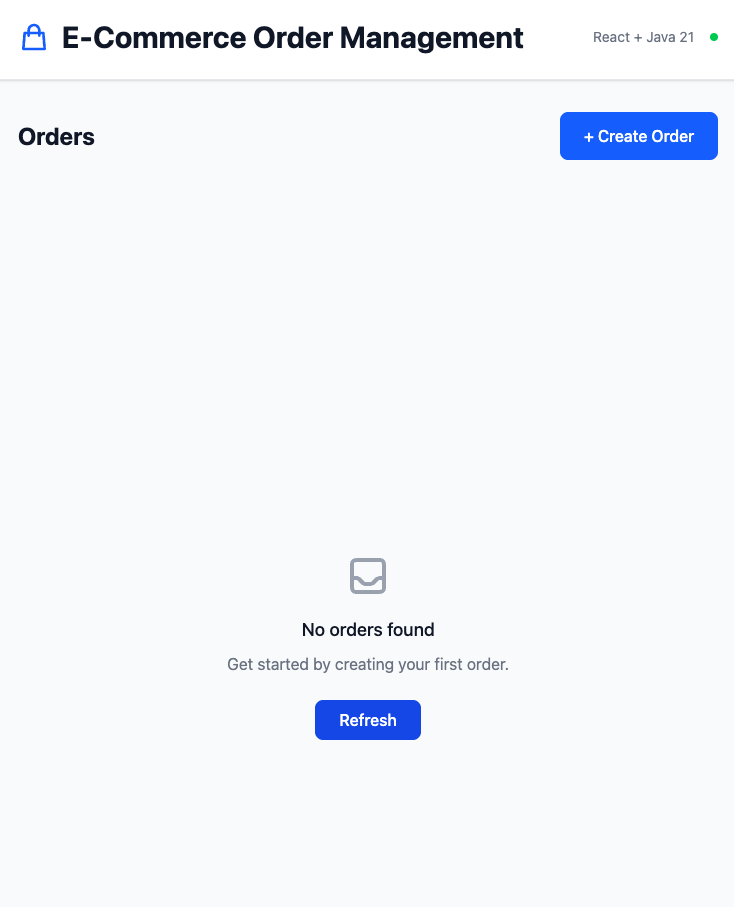
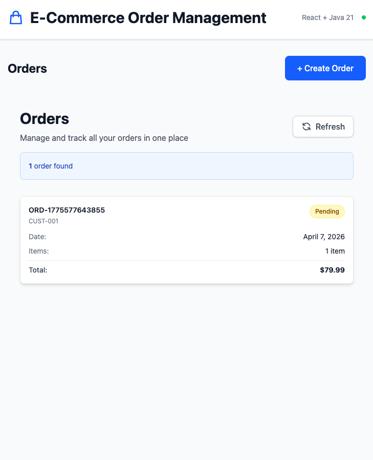
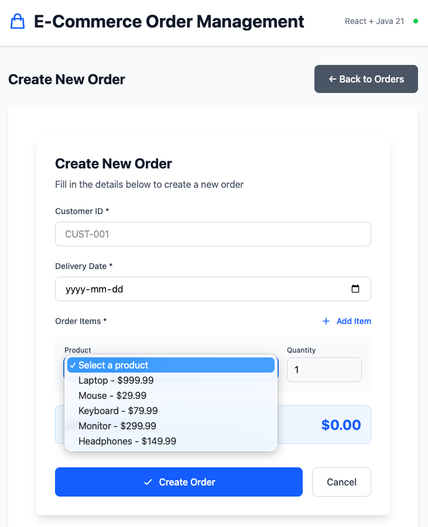

# Lab 5: Frontend Integration with Bob

**Duration:** 1 hour
**Difficulty:** Advanced
**Focus:** Use Bob to build a small React frontend for your Java 21 backend

## 🎯 Objectives

By the end of this lab, you will:
- Use Bob to analyze backend APIs for frontend development
- Ask Bob to design a simple frontend architecture
- Build a small React app that lists orders and creates a new order

## 📋 Prerequisites

- [ ] Labs 1-4 completed
- [ ] `legacy-codebase` contains your migrated Java 21 application

### Reference Implementation
A completed sample is available in `completed/`.

You can run it with:

- Backend: `cd lab5-built-your-frontend/completed/legacy && mvn spring-boot:run`
- Frontend: `cd lab5-built-your-frontend/completed/frontend && npm install && npm run dev`

## 🧩 Your Task

Ask Bob to create a React frontend that integrates with this backend.

> [!IMPORTANT]
> Keep the scope small.
> This lab does **not** require UI for every backend capability.
> A good target is:
> - view existing orders
> - create a new order
>
> Payments, inventory, and other backend flows can be treated as optional stretch goals.

## 🔨 Exercise

### Step 1: Start the Backend

First, start the Java backend:
```bash
cd legacy-codebase/
mvn spring-boot:run
```

The backend will run on: **http://localhost:8080**

Verify it's working:
```bash
curl http://localhost:8080/api/orders
```

### Step 2: Analyze the Backend

Ask Bob to inspect the backend and summarize what matters for the frontend.

**Ask Bob to cover:**
- where the backend code lives
- the workflow you want to build
- the API details the frontend needs

**Bob should identify:**
- `GET /api/orders` - list orders
- `POST /api/orders` - create order
- `GET /api/orders/{id}` - get order details
- `PUT /api/orders/{id}/status` - update order status
- `POST /api/payments` - process payment
- `GET /api/inventory/check` - check inventory

> 💡 You do not need to build UI for all of these endpoints.
> Focus on the core order workflow for this lab.

### Step 3: Plan the Frontend

Ask Bob to design the frontend before implementation.

**Define:**
- the user experience: single-page demo or multi-page app
- the minimum features: e.g. view orders and create a new order
- the preferred stack, if you have one

**If you want recommendations first:**
- switch to **Plan mode 📝**
- ask Bob to suggest a frontend stack and structure before coding

**Example stack direction:**
- React + TypeScript + Vite + Tailwind CSS

### Step 4: Create the Frontend Project

Ask Bob to set up the project.

**Specify:**
- where the frontend should be created
- which tools or libraries to use
- whether you want a minimal starter or a fuller scaffold

**Bob will likely:**
- initialize a Vite project
- configure TypeScript
- set up Tailwind CSS
- create the folder structure

### Step 5: Implement Components

Ask Bob to build the components.

**Describe:**
- the screens or components you need
- the main user interactions
- UX expectations such as validation, loading states, responsiveness, and error handling

**Bob will likely create:**
- type-safe React components
- API integration
- form validation
- responsive UI

### Step 6: Test the Integration

Start the frontend:
```bash
cd legacy-codebase/frontend
npm install
npm run dev
```

Frontend runs on: **http://localhost:5173**

Test the workflow:
1. View orders list (empty initially)
2. Click "Create Order"
3. Fill form and submit
4. See new order in the list

## ✅ Success Criteria

You've completed this lab when:
- [ ] You asked Bob to analyze the backend API for frontend use
- [ ] You created a small frontend that lists orders
- [ ] You created a form to add a new order
- [ ] You tested the frontend against the running backend

## 📁 What Bob Might Create

### Example Frontend Structure
```
frontend/
├── public/
│   ├── favicon.svg          # App icon
│   └── icons.svg            # SVG icon sprites
├── src/
│   ├── App.tsx              # Main single-page app
│   ├── App.css              # App styles
│   ├── main.tsx             # Entry point
│   ├── index.css            # Global styles
│   ├── assets/
│   │   ├── hero.png         # Hero image
│   │   ├── react.svg        # React logo
│   │   └── vite.svg         # Vite logo
│   ├── components/
│   │   ├── OrderList.tsx    # Display orders
│   │   └── OrderForm.tsx    # Create orders
│   ├── services/
│   │   └── api.ts           # API client
│   ├── types/
│   │   ├── index.ts         # Type exports
│   │   ├── order.types.ts   # Order types
│   │   ├── payment.types.ts # Payment types
│   │   └── api.types.ts     # API response types
│   └── utils/
│       ├── formatters.ts    # Format helpers
│       └── validators.ts    # Validation
├── package.json
├── vite.config.ts
└── tailwind.config.js
```
### UI Example
Your app does not need to match the sample exactly.
Use it as inspiration, then explore your own design with Bob 🤖🎨




---

## 💡 Tips for Working with Bob

### Be Specific
❌ "Create a frontend"
✅ "Create a React frontend that lists orders and lets users create a new order"

### Iterate
1. Start with a small version
2. Add features gradually
3. Refine after testing

### Ask for Explanations
- Why did you choose this API integration approach?
- How do the frontend types map to the backend DTOs?
- How does the validation strategy work?
- What are the tradeoffs in this component structure?

### Request Improvements
- Make error messages easier for end users to understand.
- Add loading and empty states.
- Improve the mobile layout.
- Strengthen client-side validation.
- Simplify the code and remove unnecessary complexity.
